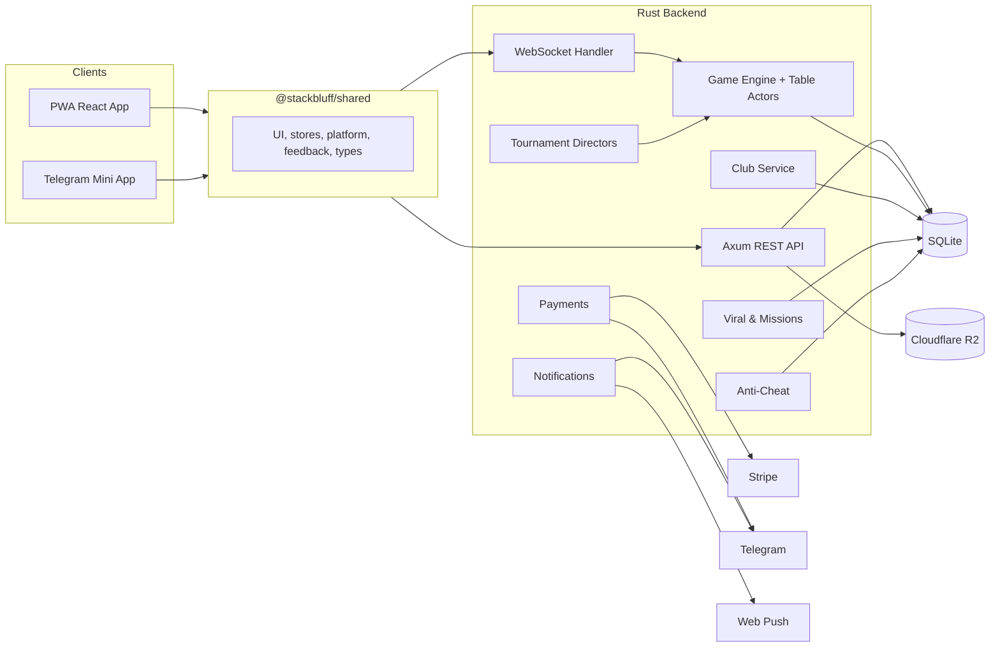

<div align="center">
  
  <p>
    <strong>A free‑to‑play, multi‑platform (Telegram Mini App + PWA) social poker platform</strong><br/>
    with a <strong>sub‑10ms Rust/WebSocket engine</strong>, built end‑to‑end by <strong>5 parallel AI agents</strong> with zero merge conflicts. Ships real poker, clubs, tournaments, an AI coach ("The Oracle"), and a card‑compositor toolchain — all play‑money, GDPR‑compliant, on a €100 bootstrap budget.
  </p>
  <p>
    
    
    
    
    
    
    
    
    
    
    
    
    
  </p>
</div>

---

StackBluff is a full-stack poker platform built as a monorepo. It ships a Rust/Axum backend, a React PWA, and a Telegram Mini App. The backend owns the real-time game engine, table actors, tournaments, clubs, missions, referrals, payments, notifications, anti-cheat, and GDPR flows. The frontend is a shared React codebase with platform-specific entry points for browser and Telegram.

> [!NOTE]
> The backend runs SQL migrations automatically on startup and seeds demo tables when the database is empty.

## Features

| Area | What it includes |
| --- | --- |
| Cash games | Lobby, table creation, buy-in, rebuy, sit-out, kick votes, real-time actions, showdowns, hand history |
| Tournaments | Sit & Go and MTT directors, blind scheduler, payout calculator, table rebalancing, final table merge, reminders, crash recovery |
| Clubs | Create/join clubs, divisions, weekly XP leaderboards, club tournaments, Club Pro banner/chip/felt customization |
| Progression | Daily missions, streaks, rerolls, claim rewards, referrals, Founding Member badge |
| Monetization | Chips, Season Pass, Club Pro, Stripe Checkout, Telegram Stars, entitlement expiry |
| Game intelligence | Oracle hand analysis, daily puzzles, replay cards for significant hands |
| Notifications | Web Push (VAPID), Telegram bot messages, email via Resend, user notification preferences |
| Cross-platform | PWA with offline support, install prompt, service worker, Telegram Mini App with `initData` auth |
| Feedback | Procedural Web Audio, haptics, visual glow/shake effects, spatial audio presets |
| Safety | Rate limiting, account lockout, transfer tracking, IP collusion, device fingerprinting, GDPR export/deletion |
| Observability | Sentry, Prometheus `/metrics`, structured JSON logs, correlation IDs |

## Architecture



At runtime, a client authenticates with JWT, connects over WebSocket, and joins a table. The table registry creates an actor-backed room that owns the game state and broadcasts messages such as `TableState`, `ActionRequired`, `ActionBroadcast`, `ShowdownReveal`, and `HandResult`. Hand-completion events fan out to hand history, stats, missions, referral tracking, replay-card generation, and tournament directors.

## Tech Stack

| Layer | Technology |
| --- | --- |
| Backend | Rust 1.94, Axum 0.8, Tokio, SeaORM 2 RC, SQLite, jsonwebtoken, Argon2, teloxide |
| Frontend | React 19, TypeScript, Vite 8, TanStack Router/Query/Form, Tailwind CSS v4, Zustand, Framer Motion |
| Tooling | pnpm workspaces, Cargo workspace, Biome, Vitest, Puppeteer, Lingui |
| Integrations | Stripe Checkout, Telegram WebApp/Stars, Web Push VAPID, Cloudflare R2, Resend |
| Observability | Sentry, Prometheus, tracing-subscriber JSON logs |

## Project Structure

```text
.
├── frontend/
│   ├── apps/
│   │   ├── pwa/                  # Installable PWA
│   │   └── mini-app/             # Telegram Mini App
│   ├── packages/
│   │   └── shared/               # Shared UI, stores, platform, feedback, types
│   ├── package.json
│   └── pnpm-workspace.yaml
├── backend/
│   ├── crates/
│   │   ├── sb-server/            # Axum entrypoint, wiring, background jobs
│   │   ├── sb-game-engine/       # Deck, hand evaluation, betting, pots
│   │   ├── sb-table-registry/    # Table actors, rooms, events
│   │   ├── sb-ws-handler/        # WebSocket auth and client protocol
│   │   ├── sb-tournament/        # Sit & Go / MTT directors
│   │   ├── sb-club/              # Clubs, divisions, leaderboards
│   │   ├── sb-auth/              # JWT, email, Telegram auth
│   │   ├── sb-payment/           # Stripe, Telegram Stars, entitlements
│   │   ├── sb-notification/      # Telegram, Web Push, multi-channel
│   │   ├── sb-anti-cheat/        # Rate limits, collusion, fingerprints
│   │   ├── sb-mission/           # Daily missions and streaks
│   │   ├── sb-viral/             # Referrals, replay cards, badges
│   │   ├── sb-oracle/            # Hand analysis templates
│   │   ├── sb-db-repos/          # SeaORM repositories and writer loop
│   │   ├── sb-db-entities/       # SeaORM models
│   │   ├── sb-contracts/         # Service and repository traits
│   │   └── sb-shared-types/      # IDs, cards, chips, errors, game types
│   ├── migration/                # SQL migrations and seed data
│   └── Cargo.toml
└── README.md
```

## Getting Started

### Prerequisites

- Node.js `>= 20`
- pnpm `10.8.1`
- Rust `1.94`
- SQLite 3

### Backend

```bash
cd backend
cp .env.example .env   # if present, or create .env manually
cargo run --bin sb-server
```

The API listens on `http://localhost:3000` by default. Set `PORT` to override. On first run, migrations create the schema and seed base tables.

Example backend `.env`:

```env
DATABASE_URL=sqlite://stackbluff.db?mode=rwc
JWT_SECRET=change-me
TELEGRAM_BOT_TOKEN=your-telegram-bot-token
STRIPE_SECRET_KEY=sk_test_...
STRIPE_WEBHOOK_SECRET=whsec_...
STRIPE_SUCCESS_URL=http://localhost:5173/payment/success
STRIPE_CANCEL_URL=http://localhost:5173/payment/cancel
APP_BASE_URL=http://localhost:5173
R2_ENDPOINT=https://your-r2-endpoint
R2_BUCKET=your-bucket
VAPID_PUBLIC_KEY=your-vapid-public-key
VAPID_PRIVATE_KEY_PEM=your-vapid-private-key
VAPID_SUBJECT=mailto:admin@example.com
SENTRY_DSN=
```

### Frontend

```bash
cd frontend
pnpm install
pnpm dev
```

This starts both apps:

| App | URL |
| --- | --- |
| PWA | `http://localhost:5173` |
| Telegram Mini App | `http://localhost:5174` |

Run one app at a time:

```bash
pnpm dev:pwa
pnpm dev:mini
```

> [!TIP]
> The Mini App expects Telegram WebApp APIs. Use Telegram or a compatible emulator for full behavior.

### Frontend Environment

Create `frontend/apps/pwa/.env.local` and `frontend/apps/mini-app/.env.local` as needed:

```env
VITE_API_BASE_URL=http://localhost:3000
VITE_WS_URL=ws://localhost:3000
VITE_VAPID_PUBLIC_KEY=your-vapid-public-key
VITE_STRIPE_PUBLISHABLE_KEY=pk_test_...
VITE_SENTRY_DSN=
VITE_SENTRY_ENVIRONMENT=development
VITE_PLAUSIBLE_DOMAIN=localhost
VITE_PLAUSIBLE_API_HOST=http://localhost:8000
VITE_TELEGRAM_BOT_USERNAME=StackBluffBot
VITE_ADMIN_MODE=false
```

## Available Scripts

### Frontend root

| Command | Description |
| --- | --- |
| `pnpm dev` | Run PWA and Mini App concurrently |
| `pnpm dev:pwa` | Run only the PWA |
| `pnpm dev:mini` | Run only the Telegram Mini App |
| `pnpm build` | Build all workspace packages |
| `pnpm test` | Run workspace tests |
| `pnpm lint` | Run Biome checks |
| `pnpm lint:fix` | Auto-fix Biome issues |

### PWA

| Command | Description |
| --- | --- |
| `pnpm --filter @stackbluff/pwa extract` | Extract Lingui messages |
| `pnpm --filter @stackbluff/pwa compile` | Compile Lingui catalogs |
| `pnpm --filter @stackbluff/pwa test:e2e` | Run Puppeteer E2E tests |
| `pnpm --filter @stackbluff/pwa test:e2e:headless` | Run E2E in headless mode |

### Backend

| Command | Description |
| --- | --- |
| `cargo run --bin sb-server` | Start the API and WebSocket server |
| `cargo test` | Run Rust tests |
| `cargo build --release --bin sb-server` | Build a production binary |

## Testing

StackBluff uses multiple test layers:

- **Backend unit/integration tests** — in-memory SQLite, `mockall`, `wiremock`, migration tests, payout/rebalance tests, auth tests, tournament tests.
- **Frontend unit tests** — Vitest with jsdom and Testing Library.
- **PWA E2E** — Puppeteer with isolated browser contexts for multi-user Sit & Go and MTT flows.
- **Lint/format** — Biome for TypeScript/JavaScript and Cargo fmt/clippy for Rust.

```bash
# Backend
cd backend
cargo test

# Frontend
cd frontend
pnpm test
pnpm lint

# PWA E2E
pnpm --filter @stackbluff/pwa test:e2e
```

> [!IMPORTANT]
> E2E tests start the Rust backend and Vite frontend automatically. They use a separate SQLite test database and require a working Rust toolchain.

## Key Backend Crates

| Crate | Responsibility |
| --- | --- |
| `sb-server` | Axum app, background jobs, scheduler, dependency wiring |
| `sb-game-engine` | Deck, 7-card hand evaluation, betting rounds, side pots |
| `sb-table-registry` | Table actors, room lifecycle, event bus, stats aggregation |
| `sb-ws-handler` | Authenticated WebSocket upgrade and client message routing |
| `sb-tournament` | Sit & Go and MTT actors, blinds, payouts, rebalancing |
| `sb-club` | Club membership, divisions, leaderboards, Club Pro settings |
| `sb-auth` | JWT, email/password, Telegram auth, verification, reset |
| `sb-payment` | Stripe Checkout, Telegram Stars, webhooks, entitlements |
| `sb-notification` | Telegram notifications, Web Push, multi-channel fanout |
| `sb-anti-cheat` | Rate limiting, transfer limits, IP/device collusion checks |
| `sb-mission` | Daily missions, streaks, reroll, claim rewards |
| `sb-viral` | Referral bonuses, replay cards, Founding Member badge |
| `sb-oracle` | Heuristic poker advice and templates |
| `sb-db-repos` | SeaORM repositories, writer loop, GDPR, stats, history |
| `sb-db-entities` | SeaORM entities and enums |
| `sb-contracts` | Trait boundaries for services and repositories |
| `sb-shared-types` | Strong IDs, cards, chips, errors, game types |

## Database and Migrations

- Default database: SQLite (`sqlite://stackbluff.db?mode=rwc`).
- WAL mode is enabled during migration for better concurrency.
- Migrations live in `backend/migration`.
- Seed data includes demo tables and tournaments.
- Hand histories older than `HAND_HISTORY_RETENTION_DAYS` are cleaned up in the background.
- Archived hands and generated assets are stored in Cloudflare R2.

## Realtime Protocol

WebSocket clients receive typed messages such as:

- `TableState`
- `ActionRequired`
- `ActionBroadcast`
- `ShowdownReveal`
- `HandResult`
- `TournamentState`
- `TournamentRegistered`
- `TournamentStarting`
- `TournamentBlindLevel`
- `TournamentTableChanged`
- `TournamentResult`
- `KickVoteStarted`
- `KickVoteUpdate`
- `PlayerRemoved`

Client messages include `join_table`, `reconnect`, `player_action`, `rebuy`, `leave_table`, `sit_out`, `kick_vote_start`, `kick_vote_yes`, `register_tournament`, and `spectate_tournament`.

## Security and Privacy

- JWT auth with optional cookie or `Authorization: Bearer` token.
- Argon2id password hashing.
- Email verification and password-reset tokens with TTLs.
- Login lockout and per-IP/per-user rate limiting.
- Anti-cheat transfer limits and head-up collusion tracking.
- Device fingerprint submission for collusion detection.
- GDPR data export and account-deletion request flow.
- Secrets are read from environment variables. Never commit real keys.

## Internationalization

The PWA uses Lingui with catalogs for:

- English (`en`)
- French (`fr`)
- Spanish (`es`)

Messages are extracted from source and compiled into `messages.mjs` files.

## Deployment Notes

- Build the backend with `cargo build --release --bin sb-server`.
- Build the PWA with `pnpm --filter @stackbluff/pwa build`.
- Build the Mini App with `pnpm --filter @stackbluff/mini-app build`.
- Serve the PWA over HTTPS so service workers and Web Push work.
- Configure Stripe webhooks to hit `/payments/stripe/webhook`.
- Configure Telegram webhooks to hit `/telegram/webhook`.
- Set `CORS_ORIGINS` to a comma-separated list of allowed frontend origins.
- Expose `/metrics` only to your monitoring network.

> [!NOTE]
> The server binds to `0.0.0.0:$PORT`. Put it behind a reverse proxy for TLS, compression, and WebSocket upgrades.
