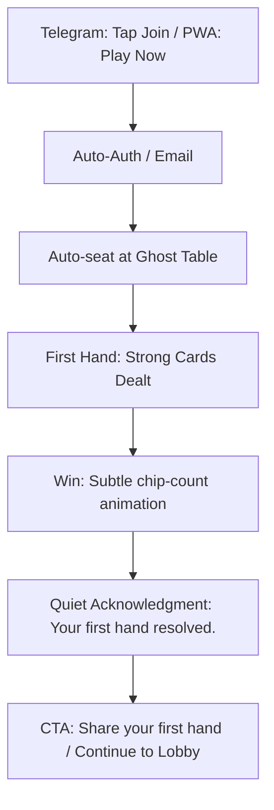

# StackBluff — UI/UX Specification Document

| Field | Value |
|-------|-------|
| **Project** | StackBluff |
| **Document** | L5 — UI/UX Specification |
| **Version** | 1.0 |
| **Date** | 2026-06-06 |
| **Status** | Canonical Design Source |
| **Traces to** | stackbluff-srs.md v0.1, stackbluff-architecture.md v0.1 |

---

## 1. Design Philosophy & Core Principles

StackBluff’s visual and interaction design is governed by a single directive: **Premium Virality**. The product must feel like a private members' club, not an arcade. Every interaction respects the user's intelligence, and every shareable artifact signals the sender's taste.

### The Four Tenets

| Tenet | Principle | Anti-Pattern |
|---|---|---|
| **1. Authority over Excitement** | Calm, measured, confident. Declarative tone. No exclamation marks. | "PLAY NOW!", "WIN BIG!", confetti bursts |
| **2. Scarcity over Saturation** | Generous white space. True scarcity (time/items). Recessive gamification. | Cluttered UI, artificial urgency, badge overload |
| **3. Refinement over Reward** | Acknowledgment of skill. Status through taste. Quiet luxury aesthetics. | Shouting about bonuses, neon colors, emoji as UI |
| **4. Social Currency over Transaction** | Sharing makes the sender look sophisticated. Invites feel like hospitality. | "Invite friends for 500 chips!", spammy referral links |

---

## 2. Visual Design System — "Midnight & Mahogany"

### 2.1 Color System

The palette shifts from neon-dark-mode to rich-dark-luxury. Deeper blacks, warmer undertones, no pure spectral colors.

```css
/* PRIMARY SURFACES */
--bg-void:       #050709;    /* Deepest background */
--bg-felt:       #0C1A14;    /* Table felt — deep forest */
--bg-panel:      #111820;    /* Elevated panels — warm charcoal */
--bg-card:       #161E2A;    /* Cards, modals — slate with warmth */
--bg-elevated:   #1C2535;    /* Hover states, active elements */

/* ACCENT SYSTEM — Restrained to 2 + gold */
--accent-primary:  #8B7EC8;  /* Muted lavender — NOT electric purple */
--accent-secondary:#4A9E8E;  /* Aged teal — NOT cyan */
--accent-gold:     #C9A84C;  /* Aged gold — NOT yellow-gold */

/* FUNCTIONAL */
--success:   #3D8B5E;       /* Muted sage */
--danger:    #A83232;        /* Deep crimson */
--warning:   #B8862D;        /* Warm amber */

/* TEXT */
--text-primary:   #E8E4DF;   /* Warm white — NOT pure #FFF */
--text-secondary: #7A7672;   /* Warm gray */
--text-tertiary:  #4A4643;   /* Dimmed */
--text-accent:    #C9A84C;   /* Gold text for rank/prestige */

/* TEXTURE OVERLAYS (subtle, 2-3% opacity) */
--grain-overlay: url("data:image/svg+xml,..."); /* Film grain, 2% opacity */
--felt-texture:  url("data:image/svg+xml,..."); /* Woven texture, 3% opacity */
```

### 2.2 Typography

Luxury design lives in contrast. A serif display font alongside a sans-serif body creates editorial sophistication.

| Role | Font | Weight | Usage |
|---|---|---|---|
| **Display** | **Playfair Display** | 700 | Rank names, season titles, section headers |
| **Body** | **Inter** | 400/500 | Descriptions, buttons, labels |
| **Data** | **JetBrains Mono** | 500/600 | Chip counts, pot sizes, odds, fractions |
| **Accent** | **Playfair Display** | 400 | Rank tier labels in small-caps (`L E G E N D`) |

*Budget:* ~285KB gzipped (Latin subset). Within 2MB core bundle limit.

### 2.3 Iconography & Rank Sigils

**Zero emoji in UI.** All ranks use custom SVG sigils—a single visual language that gains ornamentation as rank increases.

```
Brick:    ○        (plain circle, thin stroke)
Bronze:   ○──      (circle + single chevron)
Silver:   ○══      (circle + double chevron)
Gold:     ○══✦     (circle + chevrons + star)
Platinum: ○══✦✦    (circle + chevrons + dual stars + ring)
Diamond:  ○══✦✦◆   (circle + chevrons + stars + facet)
Maestro:  ○══✦✦◆≋  (circle + chevrons + stars + facet + wave)
Legend:   ◉══✦✦◆≋Λ (filled circle + full ornamentation)
```

### 2.4 Spacing & Layout

The 8px grid system. Premium products leave breathing room—the absence of content IS the content.

| Context | Spacing |
|---|---|
| Between sections | 32px |
| Between items in a list | 16px |
| Page margins (mobile) | 20px |
| Page margins (desktop) | 48px |
| Max text content width (desktop) | 960px, centered |

---

## 3. Nomenclature & Voice

Language dictates perception. StackBluff's copy treats players as adults engaged in a discipline.

| Standard Term | StackBluff Term | Rationale |
|---|---|---|
| Mission | **Intention** | Implies purpose and choice |
| Streak | **Discipline** | Commitment over time |
| Streak Shield | **Dispensation** | A granted grace period |
| Shop / Store | **The Collection** | Curated, not commercial |
| Buy / Purchase | **Acquire** | Refined transaction |
| Skins / Cosmetics | **Refinements** | Taste, not decoration |
| Free / Bonus | **Complimentary** | Privilege, not handout |
| Miracle Hand | **The Anomaly** | Statistical rarity |
| Share to Complete | **Social Courtesy** | An elegant alternative path |
| Reroll | **Reconsider** | Thoughtful change of direction |
| Leaderboard | **Standing** | Hierarchy without gamification |
| Missions Pool | **The Repertoire** | A collection of practices |

**Copy Rules:**
1. Never use exclamation marks.
2. Never use emoji in product UI or automated copy.
3. Use "complimentary" instead of "free."
4. Acknowledge luck explicitly: "A favorable outcome, not a correct decision."

---

## 4. Onboarding & First-Time Experience (FTUE)

**Constraint:** ≤3 interactions to lobby (Telegram), ≤2 min (PWA). No mandatory tutorials.

### The "Ghost Table" Pattern
New users are auto-seated at a table with 2 AI bots ("StackBot" and "BluffBot") who play slowly. The first hand is pre-configured to give the new user pocket Aces, guaranteeing a "first win" within 60 seconds.

### Flow



**First Win Display:** No confetti. Chip count animates up with a satisfying counter tick. A single-line toast: "Your first hand resolved. 2,000 chips credited."

---

## 5. Lobby & Navigation Architecture

### Navigation Model
- **Telegram Mini App:** Panel stack (no router), `Telegram.WebApp.BackButton`
- **PWA:** Bottom tab bar (mobile) / Sidebar (desktop)

### Tabs (PWA)
```
┌─────────────────────────────────────────────┐
│  🎮 Play  │  🏆 Rank  │  👥 Club  │  👤 Me  │
└─────────────────────────────────────────────┘
```
*(Icons are custom SVG, not emoji)*

### "Quick Play" Dominance
Following the Paradox of Choice, the lobby is dominated by a single **Quick Play** button that auto-matches the player to the best table based on rank and balance.

### Table Cards
Tables are displayed as horizontal cards with visual hierarchy:
1. **Stake level badge** (color-coded muted tones)
2. **Fill bar** (seat availability, animated)
3. **Social proof** ("3 Gold+ players seated")
4. **The Reservation** (Waitlist count: "Full · 4 waiting" creates premium scarcity)

---

## 6. The Table Experience — "The Private Room"

The table must feel like sitting at a real felt table under warm overhead lighting—immersive, focused, zero chrome.

### 6.1 Living Felt
The table surface renders 5 CSS layers:
1. Deep green-black radial gradient
2. SVG woven texture (3% opacity)
3. Subtle vignette (15% overlay)
4. Warm ambient light (5% warm white)
5. Table rail (subtle inner shadow in warm brown)

### 6.2 Cards & Chips
- **Cards:** Subtle inner shadow simulates thickness. Custom SVG suits. Deal animation includes 0.5° rotation wobble for realism. Card backs feature geometric SB monogram.
- **Chips:** Layered rendering with dome gradient, dashed edge spots (like real clay chips), and 0.5px lift on hover. Colors follow real casino conventions (muted tones).

### 6.3 The Decision Console (Action Bar)
Buttons are **text-only**, no background fill until hovered/pressed.
- On hover: 1px bottom border in accent color.
- Active (smart default): 1px bottom border already present.
- **Raise UI:** Preset chips ([2.5x] [½ Pot] [Pot] [All In]) replace imprecise sliders.

### 6.4 The Clockwork (Timer)
The timer is a mechanical arc, not a thick ring.
- 0–20s: Muted teal, smooth rotation.
- 20–28s: Warm amber, faster tick.
- 28–30s: Deep crimson, single gentle haptic.
- Time bank: Aged gold, smaller inner arc.

---

## 7. The Oracle — "The Advisor in the Library"

The Oracle NEVER appears during active play. It is a post-hand reflection tool.

### Entry Point
Post-hand, a recessive row appears: `Consult the Oracle →`

### Analysis Panel
- **Tone:** Declarative, precise, honest. "Your call was justified. Pot odds required 25% equity..."
- **Acknowledges luck:** "The river completed your draw—a favorable outcome, not a correct decision."
- **Season Pass Gate:** "Deeper Insight" section blurred with a muted CTA: "Opponent range analysis. Complimentary with Season One pass."

### Usage Counter
Recessive text: `Oracle · 2 of 3 complimentary analyses this session`

---

## 8. Intentions & Discipline (Mission System)

### 8.1 Today's Intentions
Players receive 3 daily intentions at 00:00 UTC. The UI is a clean, typographic list.

```
┌──────────────────────────────────────────────────┐
│  T O D A Y                                       │
│                                                  │
│  Endurance                                       │
│  Play 20 hands                                   │
│  12 of 20                                        │
│  ────────────────────────────────                │
│  ████████████░░░░░░░░                            │
│                                                  │
│  Resilience                                      │
│  Win after going all-in                          │
│  Not yet started                                 │
│  ────────────────────────────────                │
│  ░░░░░░░░░░░░░░░░░░░░                            │
│                                                  │
│  Connection                                      │
│  Share a replay card                             │
│  [ Extend a social courtesy → ]                  │
│                                                  │
│  Discipline: 4 consecutive days                  │
│  ●●●●○○○  ·  3 days until dispensation          │
└──────────────────────────────────────────────────┘
```

### 8.2 Completion Interaction
- **Progress increment:** Fraction text flashes --text-primary for 800ms. Bar extends 300ms.
- **Fulfillment:** The entire section collapses to a single line (`Endurance ✓`) with a 500ms ease. Absence is the feedback. No confetti.

### 8.3 The Anomaly (Rare Hands)
If a player hits a statistically rare hand, all intentions are fulfilled in acknowledgment.
- Full-screen takeover. Cards rendered in SVG.
- Copy: "An exceptional occurrence. 1 in 72,193 hands. All intentions fulfilled in acknowledgment."

### 8.4 Anti-Frustration
- **Reconsider:** After 30 hands with no progress, the system offers: "Calculation has seen no progress. An alternative is available." Replaces with Endurance.
- **Dispensation:** Missing a day consumes a banked Dispensation. "Your discipline continues unbroken."

### 8.5 Social Courtesy (Viral Skip)
Viral intentions (Connection, Patronage, Dispensation) offer an alternative path: **Extend a social courtesy to fulfill this intention immediately.** Generates a "Calling Card" to share.

---

## 9. Viral & Social Architecture

Virality in StackBluff is driven by social currency—sharing makes the sender look sophisticated.

### 9.1 Calling Cards (Replay Cards)
Shareable artifacts are typographic, minimal, and refined. No emoji, no "PLAY NOW!"
```
┌─────────────────────────────────────────┐
│  S T A C K B L U F F                   │
│  ─────────────────────────              │
│  A♠  K♠  Q♠  J♠  10♠                  │
│  Royal Flush                            │
│  Alexandre wins 245,000                 │
│  1 in 649,740                           │
│  ─────────────────────────              │
│  stackbluff.com/invite/abc              │
└─────────────────────────────────────────┘
```

### 9.2 The Dispatch (Group Results)
Bot posts use sports-writing narrative, not data dumps.
> "Alexandre held A♠ A♦. Marie pushed all-in with K♠ K♥. The board ran out Q♣ 7♥ 2♠ K♦ 3♣. No help for the Kings. Alexandre takes 45,000."

### 9.3 The Ambassador System
Tiered referral system where status is visible at the table.
| Level | Requirement | Title Displayed |
|---|---|---|
| Patron | 3 referrals | "Patron" |
| Host | 10 referrals | "Host" |
| Curator | 25 referrals | "Curator" |

Invitations are personalized: "Alexandre has reserved a seat for you at StackBluff."

### 9.4 The Rival
Auto-matched competitor at your rank. Visible stats comparison: "You gained 120 points on Marie this week. At this pace, you overtake in 5 days."

### 9.5 The Rail (Spectator Mode)
Every full table shows spectator count ("14 spectating"). Spectators view the table tension and chat. Shareable "Live Table Cards" create real-time urgency.

---

## 10. Clubs — "The Institution"

### 10.1 The Private Room
Clubs display founding dates ("Est. 2026"). Members are nominated and seconded by existing members.

### 10.2 The Club Chronicle
Weekly auto-generated editorial summary posted to linked Telegram groups.
> "147 hands played. Erik's pocket Kings fell to Alexandre's Ace-high flush on the river..."

Includes a join link at the bottom, turning every club into a self-sustaining viral engine.

### 10.3 Table Night
Weekly recurring event with automatic multi-channel reminders. Creates cultural rhythm and FOMO.

---

## 11. Seasons & Rank — "The Ascension"

### 11.1 The Forge (Rank-Up Animation)
When rank advances:
1. Dark screen. Faint outline of the new sigil.
2. Warm light traces the sigil's lines (laser etching metal).
3. Sigil fills with metallic color bottom-to-top.
4. Subtle warm glow radiates 300ms, then fades.
5. Return to table. New sigil on avatar.

Duration: 2.5s. Single low resonant tone (if sound enabled). No fanfare.

### 11.2 The Retrospective (Season End)
A quiet, data-rich summary modeled after a luxury brand's annual report.
```
┌──────────────────────────────────────────────────┐
│  S E A S O N   O N E                             │
│  Retrospective                                   │
│                                                  │
│  ◉══✦✦                                           │
│  P L A T I N U M                                 │
│                                                  │
│  847 hands played · 23% won · 312,000 earned     │
│  Best holding: Royal Flush, Spades               │
│                                                  │
│  ○  ○──  ○══  ○══✦  ○══✦✦                       │
│  Brick → Bronze → Silver → Gold → Platinum       │
└──────────────────────────────────────────────────┘
```

---

## 12. The Collection (Monetization)

The shop is never called "Shop." It is **The Collection**.

### 12.1 UI Design
- **Season Pass:** "Complimentary Oracle access. Season-exclusive refinements. [ Acquire ]"
- **Chip Allocations:** Numbers are the hero. No bundle names ("Starter", "Whale").
  ```
  10,000
  0.99 €
  ```
- **Table Refinements:** (Not "Skins"). "Walnut Felt. 2.99 €."

### 12.2 The Drop (Limited Cosmetics)
Following Supreme/Nike SNKRS model. One item per week, available for 24 hours only.
"Available for 18 more hours. 89 acquired so far. Once the window closes, this refinement will not be offered again."

---

## 13. Spectacle & Events

### 13.1 The Saturday Table
One designated table per week. Custom felt, named dealer, higher stakes. Limited seats create reservation scarcity. The winner receives a commemorative sigil.

### 13.2 The Main Event
Once per season. Named, promoted tournament.
"The winner receives: Season One Champion sigil (permanent). 1,000,000 chips. A named seat at The Saturday Table for Season Two."

### 13.3 Broadcaster View
OBS-friendly clean output. Streamers choose layout and delay. Spectator count displayed on table = social proof.

---

## 14. Notifications — "The Discreet Message"

Maximum 2 external notifications per day. Factual, calm, no emoji.

| Trigger | Premium Copy |
|---|---|
| New Intentions | "Today's intentions are available." |
| Discipline at risk | "Your discipline stands at 6 days. One intention remains today." |
| Referral completed | "Your guest has taken their seat. Resilience fulfilled." |
| The Double active | "The Double is active for the next 47 minutes." |
| The Saturday Table | "Two seats remain at The Saturday Table tonight." |

---

## 15. Interaction & Animation Specifications

| Element | Duration | Easing | Behavior |
|---|---|---|---|
| Button hover | 200ms | ease | 1px border fade-in |
| Button press | 100ms | ease | 0.5px downward shift |
| Card deal | 300ms | ease-out | Slide + 0.5° wobble |
| Chip slide | 250ms | ease-in-out | Slide to pot |
| Intention collapse | 500ms | ease-in-out | Height transition |
| The Anomaly | 800ms | ease | Fade-in |
| Timer arc | Continuous | linear | Smooth rotation |
| Progress increment | 300ms | ease-out | Bar extend |

**All animations respect `prefers-reduced-motion`:** durations become 0ms.

---

## 16. Sound Design — "The Ambience"

Sound is **OFF by default**. Premium default is silence. All sounds <5KB Ogg Vorbis.

| Element | Sound |
|---|---|
| Card deal | Single soft snap |
| Chip bet | Soft ceramic click |
| Timer warning (28s) | Single low tone |
| Oracle open | Soft paper/unfold |
| Rank-up | Single resonant tone (tuning fork) |
| Button press | Subtle mechanical click |

---

## 17. Platform-Specific Considerations

### Telegram Mini App
- Panel stack navigation (no router).
- Lazy load `cosmetics` and `social` chunks (6MB total Mini App limit).
- Use `Telegram.WebApp.MainButton` for primary CTA.
- Use `Telegram.WebApp.shareToStory()` for one-tap Calling Cards.
- Intentions panel is a swipe-up overlay.

### PWA
- Bottom tab bar (mobile) / Sidebar (desktop).
- Web Push notifications (opt-in after first win).
- `navigator.share()` for native share sheet.
- Custom install prompt after 3rd session.
- Optional "Immersive Mode" (Fullscreen API) on table.

---

*End of Document — StackBluff UI/UX Specification v1.0*
